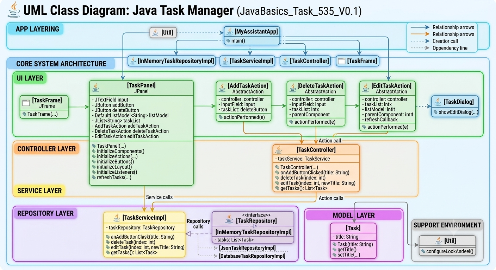

# Advanced Task Viewports: Custom List Renderers and Statistics Footers (JavaBasics_Task_537_V0.1)

## 📖 Description
Enhancing user interaction patterns requires advanced component specialization within the presentation layer. This project building directly on top of the composite navigation architecture established in **JavaBasics_Task_536_V0.1**. It introduces a highly customized **`ListCellRenderer`** backed by a **`JCheckBox`** element to track completion flags directly within the main task catalog viewport. Additionally, the lower window section is augmented with a dedicated, isolated structural sub-panel named **`TaskFooterPanel`**. This component encapsulates aggregate task tracking labels (Total, Completed, Left, Progress metrics) and couples them with centralized workflow action buttons, maintaining a strict non-designer, pure Java modular architecture.

## 📋 Requirements Compliance
- **Custom Viewport Renderer Isolation**: Created a dedicated `TaskCellRenderer` in a separate `ui.renderers` package to overlay checkboxes onto list entries.
- **Isolated Statistics Footer**: Extracted the bottom metric panel into a standalone `TaskFooterPanel` within the `ui.components` package domain.
- **Strict Interface Localization**: Enforced standard assets across all newly injected labels, tooltips, and interactive buttons.
- **Zero Designer Workspace Alignment**: Constructed all modular UI layout adapters manually without dependencies on IntelliJ IDEA GUI Form layouts.

## 🚀 Architectural Stack
- Java 17+ (Java Swing Custom Renderers, AWT Grid and Flow Layouts, Layout Cohesion Frameworks)

## 🏗️ Implementation Details
- **TaskCellRenderer**: Structural view configuration engine rendering individual JList cells as specialized JCheckBox blocks.
- **TaskFooterPanel**: Isolated dashboard wrapper updating task counters and mounting batch management anchors.
- **TaskPanel**: Core screen interface embedding both the updated task list viewer and the newly isolated footer panel.

## 📋 Expected result
- Running the program opens the multi-tab layout where the "Tasks" screen contains a distinct checkable list view.
- The footer section aligns symmetrically at the bottom, rendering localized buttons and dynamic placeholder calculations for statistics.

## 📚 UML Diagram:


## 💻 Code Example

### Project Structure:

    JavaBasics_Task_538/
    ├── src/
    │   └── com/yurii/pavlenko/
    │                 ├── app/
    │                 │   └── MyAssistantApp.java
    │                 │
    │                 ├── ui/
    │                 │   ├── frames/
    │                 │   │   └── TaskFrame.java
    │                 │   ├── panels/
    │                 │   │   ├── TaskPanel.java
    │                 │   │   └── MainTabbedPanel.java
    │                 │   ├── renderers/
    │                 │   │   └── TaskCellRenderer.java
    │                 │   ├── components/
    │                 │   │   └── TaskFooterPanel.java
    │                 │   ├── dialogs/
    │                 │   │   └── TaskDialog.java
    │                 │   └── actions/
    │                 │       ├── AddTaskAction.java
    │                 │       ├── DeleteTaskAction.java
    │                 │       ├── DeleteCompletedTasksAction.java
    │                 │       ├── ClearAllTasksAction.java
    │                 │       └── EditTaskAction.java
    │                 │
    │                 ├── controller/
    │                 │   └── TaskController.java
    │                 │
    │                 ├── service/
    │                 │   ├── impl/
    │                 │   │   └── TaskServiceImpl.java
    │                 │   └── TaskService.java
    │                 │
    │                 ├── repository/
    │                 │   ├── impl/
    │                 │   │   ├── InMemoryTaskRepositoryImpl.java
    │                 │   │   ├── JsonTaskRepositoryImpl.java
    │                 │   │   └── DatabaseTaskRepositoryImpl.java
    │                 │   └── TaskRepository.java
    │                 │
    │                 ├── model/
    │                 │   └── Task.java
    │                 │
    │                 └── util/
    │                     └── Util.java
    │
    ├── LICENSE
    ├── TASK.md
    ├── THEORY.md
    └── README.md

Code
```java
package com.yurii.pavlenko.app;

import com.yurii.pavlenko.controller.TaskController;
import com.yurii.pavlenko.repository.TaskRepository;
import com.yurii.pavlenko.repository.impl.InMemoryTaskRepositoryImpl;
// import com.yurii.pavlenko.repository.impl.JsonTaskRepositoryImpl;
// import com.yurii.pavlenko.repository.impl.DatabaseTaskRepositoryImpl;
import com.yurii.pavlenko.service.TaskService;
import com.yurii.pavlenko.service.impl.TaskServiceImpl;
import com.yurii.pavlenko.ui.frames.TaskFrame;
import com.yurii.pavlenko.util.Util;

import javax.swing.*;

public class MyAssistantApp {

    public static void main(String[] args) {

        Util.configureLookAndFeel();
        Util.configureGlobalFonts();

        TaskRepository repo = new InMemoryTaskRepositoryImpl();

        // TaskRepository repo = new JsonTaskRepositoryImpl();
        // TaskRepository repo = new DatabaseTaskRepositoryImpl();

        TaskService service = new TaskServiceImpl(repo);
        TaskController controller = new TaskController(service);

        SwingUtilities.invokeLater(() -> new TaskFrame(controller));
    }
}
```

## ⚖️ License
This project is licensed under the **MIT License**.

Copyright (c) 2026 Yurii Pavlenko

Permission is hereby granted, free of charge, to any person obtaining a copy of this software and associated documentation files...

License: [MIT](LICENSE)
