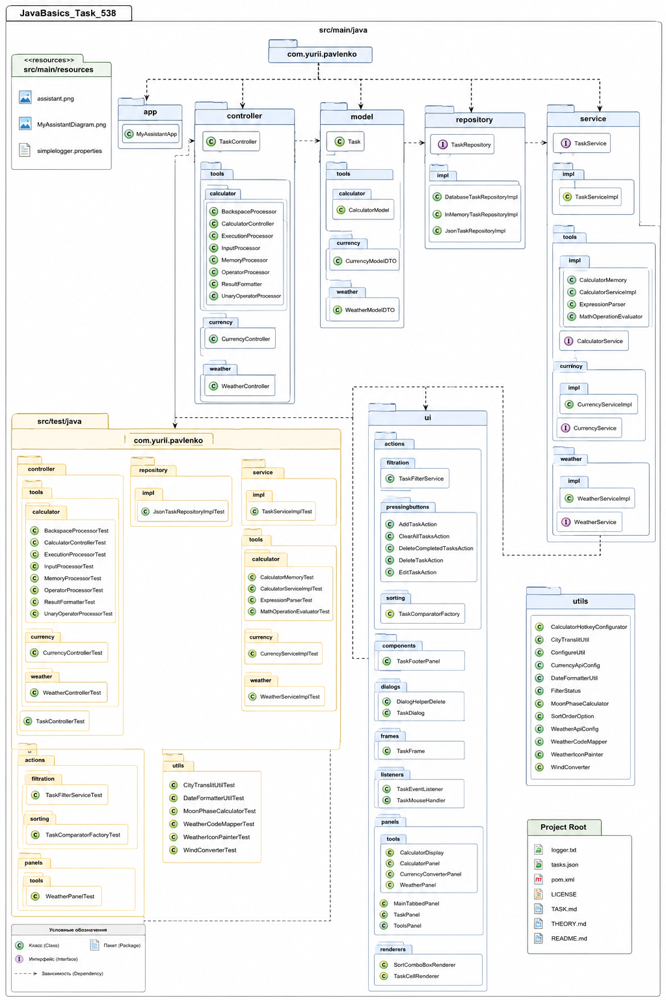

# My Assistant: Comprehensive Personal Productivity Suite (JavaBasics_Task_538_V0.1)
## 📖 Description
My Assistant is a multi-functional desktop application built upon principles of clean architecture and modularity. The project integrates task management capabilities with a specialized utility suite for daily computations, including a calculator, currency converter, and weather monitoring. Developed using Java Swing, the application adheres to strict separation of concerns—Service Layer for business logic, Repository Pattern for data access, and an MVP/MVC structure for the presentation layer—ensuring high stability and comprehensive testability.

## 📋 Requirements Compliance
Custom Viewport Renderer Isolation: Implemented a dedicated TaskCellRenderer in the ui.renderers package to support advanced list element interaction.

Isolated Statistics Footer: Extracted the bottom metric panel into a standalone TaskFooterPanel within the ui.components package.

Strict Interface Localization: Enforced standard assets across all labels, tooltips, and interactive components.

Zero Designer Workspace Alignment: Constructed all modular UI layout adapters manually, avoiding dependency on GUI Form builders.

Testing: Achieved full unit test coverage for the business logic and service layers.

## 🚀 Architectural Stack
Language: Java 23+

UI Framework: Java Swing (Manual Layout Management)

Data Persistence: Jackson (JSON serialization)

Testing: JUnit 5 (Unit testing suite)

Build Tool: Maven

## 🏗️ Implementation Details
Clean Architecture: All business processes are encapsulated within the service.impl package and verified by comprehensive unit tests.

UI-Logic Separation: Presentation logic (filtering, sorting, rendering) is strictly decoupled from the UI components, enabling high modularity.

Scalability: The application utilizes Repository and Factory patterns, allowing for seamless integration of new data sources or task types.

AI Chat (Experimental): This module is reserved for future integrations. The current architecture allows for the implementation of external LLM service wrappers or local model clients. Development is currently deferred to prioritize high-value user features over standard web-based AI interfaces.

## 📋 Expected result
Upon launching the application, the user is presented with a tabbed interface providing quick access to tasks and integrated tools. The UI supports dynamic state updates, ensuring that filtering configurations and task management actions are reflected instantly in the viewport.

## 📚 UML Diagram:


### Project Structure:

    JavaBasics_Task_538/
    ├─ src/main/java/
    │  │   │    └──────────────────────────────────────────── com/yurii/pavlenko/
    │  │   └── resources/images/                                        ├── app/
    │  │       │         ├── assistant.png                              │   └── MyAssistantApp.java
    │  │       │         └── MyAssistantDiagram.png                     ├── controller/ 
    │  │       └── simplelogger.properties                              │   ├─ tools/
    │  └─ test/                                                         │   │  ├─ calculator/
    │     └─ java/                                                      │   │  │  ├─ BackspaceProcessor.java
    │        └─ com/                                                    │   │  │  ├─ CalculatorController.java
    │           └─ yurii/                                               │   │  │  ├─ ExecutionProcessor.java
    │              └─ pavlenko/                                         │   │  │  ├─ InputProcessor.java
    │                 ├─ controller/                                    │   │  │  ├─ MemoryProcessor.java
    │                 │  ├─ tools/                                      │   │  │  ├─ OperatorProcessor.java
    │                 │  │  ├─ calculator/                              │   │  │  ├─ ResultFormatter.java
    │                 │  │  │  ├─ BackspaceProcessorTest.java           │   │  │  └─ UnaryOperatorProcessor.java
    │                 │  │  │  ├─ CalculatorControllerTest.java         │   │  ├─ currency/
    │                 │  │  │  ├─ ExecutionProcessorTest.java           │   │  │  └─ CurrencyController.java
    │                 │  │  │  ├─ InputProcessorTest.java               │   │  └─ weather/
    │                 │  │  │  ├─ MemoryProcessorTest.java              │   │     └─ WeatherController.java
    │                 │  │  │  ├─ OperatorProcessorTest.java            │   └── TaskController.java
    │                 │  │  │  ├─ ResultFormatterTest.java              ├── model/   
    │                 │  │  │  └─ UnaryOperatorProcessorTest.java       │   ├─ tools/     
    │                 │  │  ├─ currency/                                │   │  ├─ calculator/
    │                 │  │  │  └─ CurrencyControllerTest.java           │   │  │  └─ CalculatorModel.java
    │                 │  │  └─ weather/                                 │   │  ├─ currency/
    │                 │  │     └─ WeatherControllerTest.java            │   │  │  └─ CurrencyModelDTO.java
    │                 │  └── TaskControllerTest.java                    │   │  └─ weather/
    │                 ├─ repository/                                    │   │     └─ WeatherModelDTO.java
    │                 │  └─ impl/                                       │   └── Task.java
    │                 │     └─ JsonTaskRepositoryImplTest.java          ├─ repository/
    │                 ├─ service/impl/                                  │  ├─ impl/ 
    │                 │  │       └─ TaskServiceImplTest.java            │  │  ├─ DatabaseTaskRepositoryImpl.java
    │                 │  └─ tools/                                      │  │  ├─ InMemoryTaskRepositoryImpl.java
    │                 │      ├─ calculator/                             │  │  └─ JsonTaskRepositoryImpl.java
    │                 │      │  ├─ CalculatorMemoryTest.java            │  └─ TaskRepository.java
    │                 │      │  ├─ CalculatorServiceImplTest.java       ├─ service/
    │                 │      │  ├─ ExpressionParserTest.java            │  ├─ impl/ 
    │                 │      │  └─ MathOperationEvaluatorTest.java      │  │  └─ TaskServiceImpl.java
    │                 │      ├─ currency/                               │  ├─ tools/
    │                 │      │  └─ CurrencyServiceImplTest.java         │  │  ├─ calculator/
    │                 │      └─ weather/                                │  │  │  ├─ impl/
    │                 │         └─ WeatherServiceImplTest.java          │  │  │  │  ├─ CalculatorMemory.java
    │                 ├── ui/actions/                                   │  │  │  │  ├─ CalculatorServiceImpl.java
    │                 │   │  ├─ filtration/                             │  │  │  │  ├─ ExpressionParser.java
    │                 │   │  │  └─ TaskFilterServiceTest.java           │  │  │  │  └─ MathOperationEvaluator.java
    │                 │   │  └─ sorting/                                │  │  │  └─ CalculatorService.java
    │                 │   │     └─ TaskComparatorFactoryTest.java       │  │  ├─ currency/
    │                 │   └─ panels/tools/                              │  │  │  ├─ impl/ 
    │                 │             └─ WeatherPanelTest.java            │  │  │  │  └─ CurrencyServiceImpl.java
    │                 └── utils/                                        │  │  │  └─ CurrencyService.java
    │                     ├─ CityTranslitUtilTest.java                  │  │  └─ weather/
    │                     ├─ DateFormatterUtilTest.java                 │  │     ├─ impl/
    │                     ├─ MoonPhaseCalculatorTest.java               │  │     │  └─ WeatherServiceImpl.java
    │                     ├─ WeatherCodeMapperTest.java                 │  │     └─ WeatherService.java
    │                     ├─ WeatherIconPainterTest.java                │  └─ TaskService.java
    │                     └─ WindConverterTest.java                     ├── ui/
    │                                                                   │   ├─ actions/
    │                                                                   │   │  ├─ filtration/
    │                                                                   │   │  │  └─ TaskFilterService.java
    │                                                                   │   │  ├─ pressingbuttons/
    │                                                                   │   │  │  ├─ AddTaskAction.java
    │                                                                   │   │  │  ├─ ClearAllTasksAction.java
    │                                                                   │   │  │  ├─ DeleteCompletedTasksAction.java
    │                                                                   │   │  │  ├─ DeleteTaskAction.java
    │                                                                   │   │  │  └─ EditTaskAction.java
    │                                                                   │   │  └─ sorting/
    │                                                                   │   │     └─ TaskComparatorFactory.java
    │                                                                   │   ├─ components/
    │                                                                   │   │  └─ TaskFooterPanel.java
    │                                                                   │   ├─ dialogs/
    │                                                                   │   │  ├─ DialogHelperDelete.java
    │                                                                   │   │  └─ TaskDialog.java
    │                                                                   │   ├─ frames/
    │                                                                   │   │  └─ TaskFrame.java
    │                                                                   │   ├─ listeners/
    │                                                                   │   │  ├─ TaskEventListener.java
    │                                                                   │   │  └─ TaskMouseHandler.java
    │                                                                   │   ├─ panels/
    │                                                                   │   │  ├─ tools/
    │                                                                   │   │  │  ├─ CalculatorDisplay.java
    │                                                                   │   │  │  ├─ CalculatorPanel.java
    │                                                                   │   │  │  ├─ CurrencyConverterPanel.java
    │                                                                   │   │  │  └─ WeatherPanel.java
    │                                                                   │   │  ├─ MainTabbedPanel.java
    │                                                                   │   │  ├─ TaskPanel.java
    │                                                                   │   │  └─ ToolsPanel.java
    │                                                                   │   └─ renderers/
    │                                                                   │      ├─ SortComboBoxRenderer.java
    │                                                                   │      └─ TaskCellRenderer.java
    │                                                                   └── utils/
    │                                                                       ├─ CalculatorHotkeyConfigurator.java
    │                                                                       ├─ CityTranslitUtil.java
    │                                                                       ├─ ConfigureUtil.java
    │                                                                       ├─ CurrencyApiConfig.java
    │                                                                       ├─ DateFormatterUtil.java
    │                                                                       ├─ FilterStatus.java
    │                                                                       ├─ MoonPhaseCalculator.java
    │                                                                       ├─ SortOrderOption.java
    │                                                                       ├─ WeatherApiConfig.java
    │                                                                       ├─ WeatherCodeMapper.java
    │                                                                       ├─ WeatherIconPainter.java
    │                                                                       └─ WindConverter.java
    ├── logger.txt
    ├── tasks.json
    ├── pom.xml
    ├── LICENSE
    ├── TASK.md
    ├── THEORY.md
    └── README.md

## 💻 Code Example

```java
package com.yurii.pavlenko.app;

import controller.main.com.yurii.pavlenko.TaskController;
import repository.main.com.yurii.pavlenko.TaskRepository;
import impl.repository.main.com.yurii.pavlenko.InMemoryTaskRepositoryImpl;
// import impl.repository.main.com.yurii.pavlenko.JsonTaskRepositoryImpl;
// import impl.repository.main.com.yurii.pavlenko.DatabaseTaskRepositoryImpl;
import service.main.com.yurii.pavlenko.TaskService;
import impl.service.main.com.yurii.pavlenko.TaskServiceImpl;
import frames.ui.main.com.yurii.pavlenko.TaskFrame;
import util.main.com.yurii.pavlenko.Util;

import javax.swing.*;

public class MyAssistantApp {

    public static void main(String[] args) {

        Util.configureLookAndFeel();
        Util.configureGlobalFonts();

        TaskRepository repo = new InMemoryTaskRepositoryImpl();

        // TaskRepository repo = new JsonTaskRepositoryImpl();
        // TaskRepository repo = new DatabaseTaskRepositoryImpl();

        TaskService service = new TaskServiceImpl(repo);
        TaskController controller = new TaskController(service);

        SwingUtilities.invokeLater(() -> new TaskFrame(controller));
    }
}
```

## ⚖️ License
This project is licensed under the **MIT License**.

Copyright (c) 2026 Yurii Pavlenko

Permission is hereby granted, free of charge, to any person obtaining a copy of this software and associated documentation files...

License: [MIT](LICENSE)
